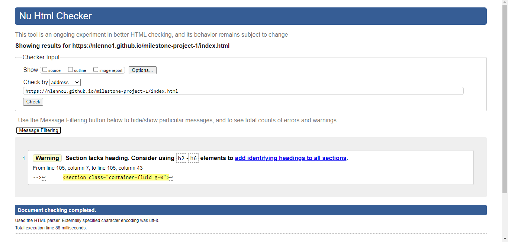
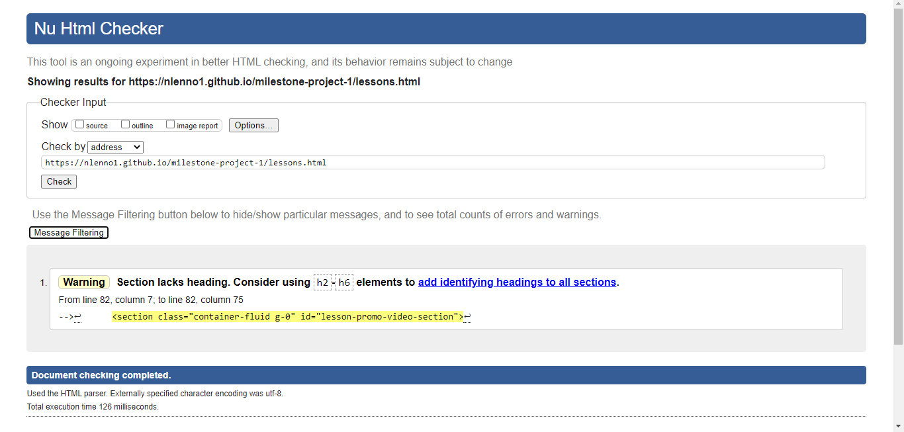
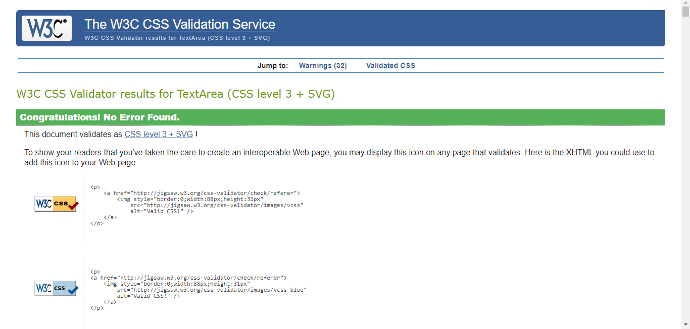
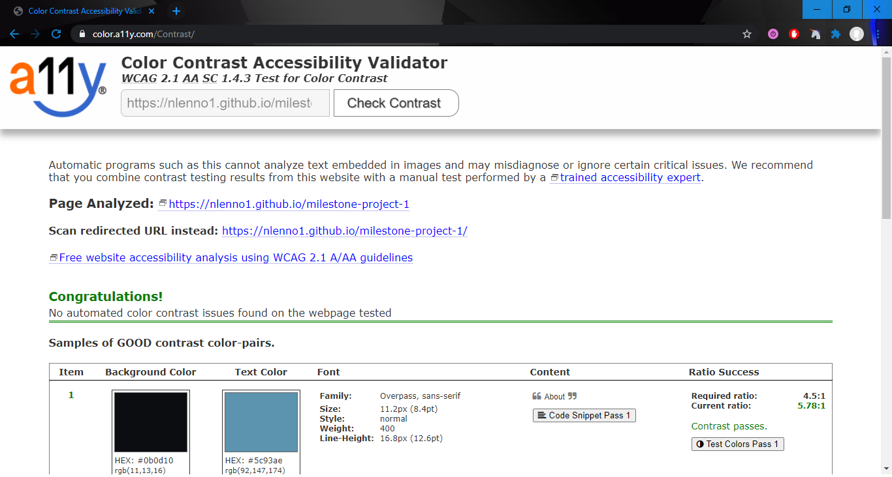
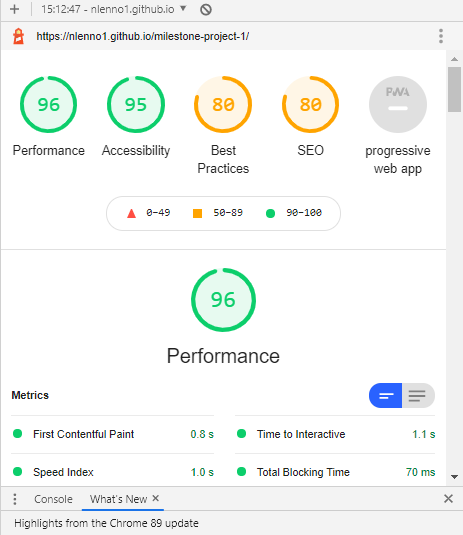

# Nick Lennon - Drummer

[Link to the Live Project](https://nlenno1.github.io/milestone-project-1/)

# Table of Contents

1. [Introduction](#introduction)
2. [UX](#ux)
3. [Development Planes](#development-planes)
    - [Strategy](#strategy)
    - [Scope](#scope)
    - [Structure](#structure)
    - [Skeleton](#skeleton)
4. [Design](#design)
5. [Features](#features)
6. [Technologies Used](#technologies-used)
7. [Testing](#testing)
8. [Bugs and Issues](#bugs-and-issues)
9. [Validation](#validation)
10. [Deployment](#deployment)
11. [Credits](#credits)

***

#  Introduction

This website has been designer for the **Drummer Nick Lennon** (from here on will be referred to as the “client”) who is a musician who offers services, including **live music performance, recording sessions and tutoring**, to all clients who have an interest in creating, listening to or learning how to play live music. 

This website is based on my own previous work, with some fictitious information added as example content,  before taking up coding as it is an area I am very familiar with and completely understand the needs of the client and the user.

This is the first of four Milestone Projects that make up the Full Stack Web Development Program at The Code Institute. The main requirements of this project are to create a responsive and static website with a minimum of three pages using primarily **HTML5** and **CSS3**.

[Back to top](#nick-lennon---drummer)

# UX
### Project Goals
- To produce a well-designed and engaging website to advertise all services in the most efficient way possible
- To make it easy for users to navigate and access all the information they need.
- To allow users to learn more about the client and their experience.
- To enable users to contact the clientTo showcase the clients abilities	 
- To maintain a clean and professional image at all times
- To enable users to contact the client

## User Demographic
The target demographics for this web site are:
- Potential Students,
- Fellow Musicians or Potential Collaborators,
- Fans of Nick Lennon,
- Agents,Recruiters or Potential Employers,

## User Stories

- As a **Potential Student** I want to find information on the client’s lessons, the client’s experience, see previous student testimonials and view examples of the lesson content to help me establish if the client is a good teacher, to encourage me to get in touch if I have any questions and to sign up for lessons
- As a **Musician/Potential Collaborator**, I want to see the client’s previous work/performances, experience and training to allow me to decide if I want to work with them in the future and then to find easy ways to contact them.
- As a **Fan** who saw the client perform, I want to find more information about the client including what their latest music or video is, pictures of client and pervious performances, links to clients current projects, when their next show is, links to buy tickets and to connect with their social networks.
- As an **Agent,Recruiter or Potential Employer**, I want to see information about the client’s training and experience as well as be able to view performances to establish the client’s playing ability and be able to download a copy of the information for future reference, before having an easy way to get in touch.

[Back to top](#nick-lennon---drummer)

# Development Planes
## Strategy
The website will focus on the following user attributes:

**Demographics**
- Ages 18 - 50 years old
- All Genders and Ethnicities
- Employed or Self-Employed

**Psychographics**
- Personalities
    - Outgoing
    - Confident
    - Modest in their abilities
- Lifestyles and attitudes
    - Active interest or passion in Music
    - Looking for new challenges
    - Interested in learning
    - Open to taking advice and constructive criticism

The website needs to enable the **USER** to:
   
    Find information on:
    - Future Performances
    - Client's experience and previous work
    - Services that the client offers
    - How to contact the client
    - Signing up to the clients mailing list

The website needs to enable the **CLIENT** to:
   
    - Develop an online presence
    - Increase social media following
    - Showcase their porfolio
    - Attract new students
    - Encourage users to contact the client about future work
    - Promote future performances

I performed a Importance-Viability analysis on the clients needs to ensure that they were both important enough to need to be taken into consideration with this project but also to ensure that they are viable to do with all factors considered. The results look like this:

As you can see all goals set out are viable and important enough to be included.

[Back to top](#nick-lennon---drummer)

## Scope
A scope was defined to identify what needed to be included in the project to complete the goals defined in the strategy section.

**Content Requirements**

    - Images of the client and previous performances
    - Future live performance information with links to ticket sales
    - Video performance examples
    - Client biography with basic CV download optiion
    - Studio credits with links to preview and buy the recordings
    - Drum lesson promotion video
    - Description of drum lesson services
    - Drum lesson example video with accompanying PDF download
    - Call to action to get in contact in regards to lessons and project enquires
    - Mailing list sign up form
    - Provides contact information

**Functionality Requirements**

    - Easy navigation to the required information
    - Quick loading of the website
    - Links to:
        - external websites for ticket sales and to purchase music
        - social media accounts
        - media sites (youtube for other videos and soundcloud/spotify to listen to music))
    - Mailing list sign up form
    - Links to social media accounts
    

[Back to top](#nick-lennon---drummer)

## Structure

This website is organised using a **Tree** structure hireracy to reduce complexiy and make user navigation easier while allowing for a small amount of user exploring to discover information they didn't initially come to the website for.

Here is a diagram of the page structures.

## Reasoning for the page structuring
**index.html** *(linked to from Logo)*. Decided on element order of:
1.	Hero image with name – to confirm identity of website and create a nice landing page,
2.	What I do – to allow quick and easy navigation to desired information while informing new visitors about the client's services.
3.	Gallery – To provide images of the client and previous performances to encourage them to see the client live.
4.	Future Performances with Video Performance Example – *(linked to from What I Do)* Advertises future performances, with direct links to ticket sales, and shows an example of a live show to encourage new visitors to buy tickets. These elements have been places at the bottom as fans coming looking for new performances to see will also see the social links in the Footer as the screen size from the top of Future Performances includes the footer. Using a link from YouTube will also direct the user to videos of other performances and shows increasing social media engaguement.
	
**about.html**. Decided on element order of:
1.	Image, Bio and Career Highlights (with CV download link) - this is what users that selected the about me page will be looking for primarily with the download link for the Agent,Recruiter or Potential Employer demographic.
2.	Studio credits - *(linked to from What I Do)* acts as evidence for the bio and when users are interested in recording services, they will also want to know about the background of the client. All album covers have links to the album to listen and purchase.

**lessons.html** *(linked to from What I Do and NavBar)*. Decided on element order of:
1.	Lessons Promotional Video – *(auto playing but muted when page loads)* gives general information in a succinct and informative way.
2.	Description of Services – general bullet point overview. Important to get information over as fast as possible if the user doesn’t watch the video or to reinforce the main points again if they do.
3.	Testimonials – potential students are not experienced in what they are looking into so can be persuaded to use the client’s services by current or previous students/parents of students leaving good reviews.
4.	Example Lesson – A video lesson example to show a user what the service would be like (including handout pdf download for the full experience)

In the footer **(linked to from the "Contact" in the Header element)** of every page there is:

- Links to social media accounts
- Contact information
- Mailing list sign up form
- Site map (desktop only)

[Back to top](#nick-lennon---drummer)

## Skeleton

Wireframes were created in Balsamiq and Figma. Balsamiq was used to design the basic structure and Figma for the design elements. This system was used to focus on the two processes seperatly, enabling each area to be tailored to the users requirements. 

Throught out the design phase some elements of the design changed to allow for a better user experience. 

I was unable to represent some UI features on the wireframes due to Figma limitations.

Full Original Balsamiq Wireframe:

Index Page (Figma):

About Me Page (Figma):

Lessons Page (Figma):

[Back to top](#nick-lennon---drummer)

# Design

## Colour Scheme
The main colours used throughout the website are a mixture of Blue primarily with Black, Silver, White and Peach highlights.

The chosen colour scheme is to give the website a modern and friendly feel that will appeal to the wide demographic.

## Typography
This project uses the fonts Overpass for body text, PT Sans for H1 headings and Roboto Condensed for sub-headings. All of these fonts use Sans Serif as the fallback font in case of import failure. 

## Imagery
The images used are all appropriate to the website and are vibrant and engaguing. Videos have been used to reduce the amount of text required in some sections.
All imagery has alternative text to accomodate the use of screen readers or if the image doesn't load.

[Back to top](#nick-lennon---drummer)
# Features

### Header 
- Company logo - establishes the website identity and doubles as the home button for only the phone breakpoint
- Navbar links with icons provides easy navigation to the desired information.
- Fix Navbar to the top of the screen to allow quick navigation at all times 
- Contact Modal to display all needed contact information quickly and giving the user a quick way to send the client an email.
### Footer
- Footer reienforces the contact information to support the Contact Modal (until contact page is implimented on next release)
- Footer email address is a link to open the users email software with a preformed email ready to edit and send to make contact easier.
- Sign Up For Newsletter (not currently linked to a mailing server but it will be implemented on next release)
- Site Map (only on Desktop breakpoint) to allow easier easier acces to specific information and some exploration
### index.html
- Hero Image - A strong image to welcome the user to the website while confirlming where the user has arrived at
- What I Do - quick navigation to the secondary topics of information
- Gallary - Gives the user a brief visual insite into the clients experience
- Upcoming Performances - Future performance details with links to ticket sales websites with a hover feature at the desktop breakpoint to reveal an image of the performance venue behind the card
- Live Performance Video - showcases a previous performance to encourage the user to buy tickets
### about-me.html
- About Me - Profile picture with biography to give in depth information about the clients background in their field
- Career highlights - A timeline element to give the user an overview of the important points from the clients career if they don't want to read the biography
- Studio Credits - Cover art of previous recording work. Each images will link to spotify to allow the user to listen to the music. Images have a hover feature to show the name of the song for the desktop breakpoint. Audio samples are also avaliable underneath the album images using Soundcloud.
- Basic CV Download - A stripped down CV PDF download to allow recruiters to retain a copy of it for future reference
### lessons.html
- Lesson Video Advert - A short advert for the clients tutoring service. The video plays but muted to draw the user in but all the important information is displayed on the screen in text.
- Lessons Overview - A revision of the main points from the video with clear icons to enable faster understanding with the contact email link to facilitate quick messaging if the user wants to get in touch.
- Testimonials - Short statements from current pupils or pupil's parents to persuade users to sign up for a lesson
- Example lesson - A short video lesson to act as an example of the clients services with a brief introduction and a download link to supporting documentation

## Features Left to Implement
* Why take Up Drumming - A section to inform the user about the many positive aspects to learning how to play the drums
* Endorses Section - A section to inform the user about what products the client uses therefore encouraging the potential student or fellow musician to use the same product which could lead to opening avenues for company collaborations
* Contact page - A new page with several contact options
* Mailing server - For the mailing list sign up and subscription to newsletter
* Online store - To give the client the ability to sell merchandise and music directly to the user

[Back to top](#nick-lennon---drummer)

# Technologies Used

- HTML5 - Programming Language
- CSS3 - Programming Language
- JavaScript - Programming Language (for the Contact Modal)
- [Bootstrap v4.3.1](https://getbootstrap.com/) - Library Import
- [Font Awesome](https://fontawesome.com/) - Icons Import
- [Phosphor Icons](https://phosphoricons.com/) - Icons Import
- [Google Fonts](https://fonts.google.com/) - Typography Import
- [Git Pod](https://gitpod.io/) - IDE (Intergrated Development Enviroment)
- [Git](https://git-scm.com/) - Version Control Tool
- [Github](https://github.com/) - Cloud based hosting service to manager my Git Repositories
- [Google Chrome Development Tools](https://developer.chrome.com/docs/devtools/) - Development Tools
- [Compress Png](https://compresspng.com/) - Image Condenser
- [Balsamiq](https://balsamiq.com/) - Wireframes
- [Figma](https://www.figma.com/) - Wireframes

[Back to top](#nick-lennon---drummer)
# Search Engine Optimisation (SEO)

Search engine optimisation was used to allow the information on the website to be accessed better by search engines.
To achive this I used an XML Sitemap file and Google Search Console.

To create an XML Sitemap you need to:

1. Go to [XML Sitemaps](https://www.xml-sitemaps.com/),
2. Enter your websites URL where prompted,
3. Click start,
4. Download the XML file,
5. Upload the XML file to the root of your repository,

To optimize your website using Google Search Console you need to:

1. Go to [Google Search Console](https://search.google.com/search-console/about),
2. Enter your websites URL in the URL Prefix section,
3. Download the generated file,
4. Upload the file to the root of your repository,
5. On the Google Search Console, click Verify,

# Bugs and Issues

- While creating the footer I had some issues with spacing and objexts being pushed where I didnt want them. After some research through the Bootstrap documentation, I realised this was because the .row class was adding extra padding so to remove this is used the .g-0 class to remove all the gutters.
- Page layout was extending under the scroll bar on the right hand side of the screen but after some research on [Stack Overflow](https://stackoverflow.com/), suggestions from the Slack Community, some tutor guidance and the [Unicorn Revealer](https://chrome.google.com/webstore/detail/unicorn-revealer/lmlkphhdlngaicolpmaakfmhplagoaln?hl=en-GB) I found an instance where I had not put an Image in its own seperate div which was causing the horixontal overflow.
- Socials links were creating a 404 page not found error. After reviewing the code, I realised that I had forgotten to include the "https://" part of the URL.
- Biography text was not wrapping round the Profile Picture. This was because they were in seperate Bootstrap .col classes so to fix this I put them in the same column and then floated the image to the right.
- Album Covers were not displying as 2 rows of 3 at desktop. To fix this I reduced the padding around them and reduced their max-width, still allowing them to shrink as the screen width dimishes.
- Soundcloud Iframe were stealing focus when loaded. After some reasearch on the soundcloud website I learnt that the autoplay value was automatically set to true so I changed this value to false to fix the bug.
- At the smallest breakpoint (280px - Galaxy Fold) the What I Do buttons where pressed together so to remedy this I changed their width to 95% and then their max width to 85px (the original width value) to allow them to shrink if the space was to small. This bug also happened with the Logo in the NavBar which was resolved using the same method.
- The text on the Bounce to Bottom class p element over the Album Covers appearing before animation could take effect. To correct this I changed the text color on the p element to rgba(0, 0, 0, 0) so it was invisible and the hvr-bounce-to-bottom class changed the text colour when it was activated and not before.

[Back to top](#nick-lennon---drummer)

# Testing

For every section that I built in the project, I tested for responsiveness during construction and after completion. To do this I used [Google Chrome Developer Tools](https://developer.chrome.com/docs/devtools/ "link to Google Chrome Developer Tools") to check that at all times the layout was how I expected it to be by dragging the screen width through all possible variaions while paying special attention to the predefined breakpoints. I also used the device models to make sure the page would provide a good UI and UX. 

This is what I tested in each section:
- NavBar
    - Logo link points to index.html
    - NavLinks point to the correct pages or sections
    - Active page icon colour changes page to page
    - NavLink icon hover effects icon colour
- Footer
    - Site map links points to the correct pages or sections
    - Social links open a new tab in the browser and load the correct social media page
    - Mailing List Sign Up email entry bar and submit button validates for correctly formatted email addresses and the input in required before the data is sent.
- index.html
    - What I Do buttons hover effects background colour
    - Gallery corner images change relative to number of columns
    - Upcoming performance links points to online ticket sales website and open in a new tab
    - Upcoming performance cards hover (at desktop breakpoint) changes background to venue image
    - Live performane video links to correct YouTube video and allows all users controls
- about-me.html
    - CV download link points to correct document, opens in a new tab and text colour is effected by hover
    - Career highlights containers and icons are effected by hover
    - Studio credits album images have drop down animation effected by hover
    - Soundcloud Iframes point to correct soundcloud songs and allows full user interaction expected
- lessons.html
    - Lessons video advert plays automatically, muted and does not loop
    - Example lesson video links to correct YouTube video and allows full user interaction expected
    -  CV download link points to correct document, opens in a new tab and text colour is effected by hover

## Device Testing

### Mobile Testing
Testing on the **Galaxy Fold** with its **280px screen width** did cause some issues when compressing elements down to that width, for example the What I Do Nav buttons were too wide and the NavBar was spreading onto 2 lines. 
To fix any of these issues I created a max-width attribute of the original size in px and then added a width attriute of a percentage in the element's CSS. This meant that when the element was too large it would scale down to the percentage of the space it had however, it would not get too big at the larger screen sizes.

To test the website at the **Mobile breakpoint**, I focused on using the **Iphone 5/SE (320px)** for the **smaller phones** and the **Iphone 6/7/8 Plus (414px)** for the **larger phones**.
All other mobile breakpoints fit into this range of screen sizes, apart from the Galaxy Fold, so therefore felt it was a good range to work with.
As this project was designed mobile first the were very few mobile only bugs or issues as it was the first breakpoint to be built.

I also used my own **Samsung Galaxy S10 (360px)** for the mobile device testing, as this is roughly the median of the range I tested on Dev Tools, to check that all elemts were accessible when used in the real world, away from Google Chrome Dev Tools.

### Tablet Testing
To test the project on a tablet, I used the **Ipad (768px)** breakpoint on Google Chrome Dev Tools as it is a very generic size and has the tablet shroud on it to help with scaling the elements.
Throughout this testing, I discovered some spacing issues which were corrected with **Media Queries** at the specific breakpoints.

I also used my own **Samsung Galaxy Tab 4 (800px)** for physical user testing.

### Desktop testing

During development, Desktop testing either used my **default screen size (1024px)** or the 1440px breakpoint in Google Chrome Dev Tools. This was to enable users who have bigger screens than myself to still have the best UI and UX possible.
There were some spacing issues at the larger screen size so again I used **Media Queries** at **min-width:1200px**to solve these issues.

For real world testing, I used an external 1440px monitor to make sure the display was as expected.

## Peer Review Testing

I asked a selection of collegues (via slack) and family members to access the project on their device:
The feedback from this was:

- Safari browser has a bug with the gallery section overflowing (Maggie Walsh),
- The object spacing on the Upcoming Performance cards is not consistent (Dorimanolova),
- Spelling errors in the README.md file (Matthew Elstone),

To respond to this feedback I:

- Did some reasearch on the Safari error and found that safari has a bug created by the column-count class is used in my css, so to remove this issue I refactored my code for that section to use .col in the html structure rather than column-count in my css,
- Reviewed the Upcoming Performance Cards, added a height attribute to the heading class to make them all consistent and then added some extra padding to the single line headings, with the custom class "one-line", to vertically center the text,
- Changed the suggested miss spelling and ran a spell checker to find anymore in the README.md,

## Browser Testing

I tested the page on on the following desktop browers to check for accesability and compatability:

- Chrome
- Edge
- Firefox
- Safari (3rd party testing only)

All of these browsers has no compatability issues.

[Back to top](#nick-lennon---drummer)

##User Stories Testing

As a **Potential Student**;
- Immediatly upon loading the website I can see at least 1 link to more information about lessons, either in the Navigation Bar or the What I Do section,
- After clicking that link I am shown an auto playing advert video with a written summary underneath if I don't want to watch the video,
- Directly below the summary is a link for contacting the client, which when clicked will open up an email application with the email address and the lesson contact subject line already added,
- To add support information, if they steh potential student needs persuading, there is the testimonial section and an example lesson video with a handout download for the user to enguage with,
- Finally, at the bottom of the page, there is a contact call to action in the footer, again with an email link to make contact easy as possible.  
- If the potential student wants to find more information on the clients experience, the about navigational button, which will take the user to the about-me.html page, is always located at the top of the page for quick access.
- There is also a contact button on the fixed navigational bar, which opens up a modal with the contact information and another email contact link, which is accessable at all times, to add to the encouragement to contact the client.

As a **Musician/Potential Collaborator**:
- Immediatly upon loading the website you will see the About link in the Navigational Bar or the Live Performance and Studio Recording button in the What I Do section, which ever is more specific to the users requirements.
- These links will either take you to:
	- Live Performance - To see what performances are in the future and there is at least 1 video underneath if the user wants to see the clients abilities first hand,
	- Studio Recordings - To allow ths user to see and listen to previous projects the client has worked on,
	- About - A biography with career highlights to give the user background information on Nick Lennon,
- All of these sections have a footer below them with a contact call to action which is linked to open up an email application with the email address and the contact subject line already added to make contact as easy as possible.
- There is also a contact button on the fixed navigational bar, which opens up a modal with the contact information and another email contact link, which is accessable at all times, to add to the encouragement to contact the client.

As a **Fan** who saw the client perform: 
 - In the What I Do section, there is the  Live Performance button to take the user to more information about upcoming performances with a video to encourage the fan to buy tickets for a show with links to the ticket sellers pages,
 - To see more images of Nick Lennon there is a gallery slightly down the main page, which they will pass when looking for the Upcoming Performances section,
 - The studio recording button in the What I Do section will take them to the latest music released by Nick Lennon,
 - Will always be able to find links to social media in the contact modal or in the footer.
 - Can find more information about Nick Lennon in the About button which is located in the fixed position Navigation bar for perminant access.

- As an **Agent,Recruiter or Potential Employer**:
- - Immediatly upon loading the website you will see the About link in the Navigational Bar or the Live Performance and Studio Recording button in the What I Do section, which ever is more specific to the users requirements.
- These links will either take you to:
	- Live Performance - To see what performances are in the future and there is at least 1 video underneath if the user wants to see the clients abilities first hand,
	- Studio Recordings - To allow ths user to see and listen to previous projects the client has worked on,
	- About - A biography with career highlights to give the user background information on Nick Lennon with a **Basic CV download link** underneath,
- All of these sections have a footer below them with a contact call to action which is linked to open up an email application with the email address and the contact subject line already added to make contact as easy as possible.
- There is also a contact button on the fixed navigational bar, which opens up a modal with the contact information and another email contact link, which is accessable at all times, to add to the encouragement to contact the client.

As a result of this testing I have found that all the different target demographics needs are met in this website while maintaing good UX principles.

# Validation

I used some validator and responsiveness testing tools to evaluate the project.

The testing tools I used were:
    
- [HTML Validator](https://validator.w3.org/) - 

- [CSS Validator](https://jigsaw.w3.org/css-validator/) - 
- [A11y](https://color.a11y.com/) to test site colours - 
- [Google Mobile-Friendly Test](https://search.google.com/test/mobile-friendly) - 
- [LightHouse](https://developers.google.com/web/tools/lighthouse) - 

[Back to top](#nick-lennon---drummer)

### Results and outcomes

All final tests produced good to excellent results apart from a few warnings from the HTML validator about not having section titles. 

The sections in question contain:
- Lesson promotions video - which has a title in the auto playing video, 
- What I Do Navigational Icons - which don't need a title as they are navigational items 
- Testimonials - which support the content next to it and therefore shares its title.

[Back to top](#nick-lennon---drummer)

# Deployment

All code was written on Gitpod, an online IDE.

This project is deployed on GitHub Pages. 
All my code was written using [Gitpod](https://www.gitpod.io/) and then pushed to a repository which was stored on my [Gitpod account](https://github.com/nlenno1/).

This is the process I used to deploy my project:

1. In my Github Repository I selected the settings tab and scrolled down to the GitHub Pages section.
2. In the source section, for the branch dropdown menu, I selected "Master" and then clicked the save button.
3. Once this process had been completed the website URL was displayed above the GitHub Pages section.

This code can be clones or forked from the [GitHub repository](https://github.com/nlenno1/milestone-project-1/).

## Forking the Repository
When you fork the repository you create a copy of the original repository on your own GitHub account to view and edit without effect the original.
To Fork something you need to:

1. Log into your GitHub account or create one.
2. Open the [repository](https://github.com/nlenno1/milestone-project-1/).
3. Click the "Fork" button which is located on the right hand side of the screen just below your user icon.
4. The fork should load and save to your GitHub account.

## Cloning the Repository
To clone the repository, you first need to:

1. Install the GitPod Browser Extension for Chrome (including restarting the browser).
2. Log into your GitHub or create an account.
3. Find the GitHub Repository that you want to clone.
4. Click the green "GitPod" button in the top right corner of the repository. This will trigger a new GitPod workspace to be created.

[Back to top](#nick-lennon---drummer)

# Credits

Code snippets
- NavBar and Modal template taken from [Bootstrap Documentation](https://getbootstrap.com/docs/5.0/components/navbar/) and customised

Resources
- [Code Institute Course Content](https://courses.codeinstitute.net/) - Code fundamental learning platform
- Code Institude Slack Community and Tutor network
- [W3 Schools](https://www.w3schools.com/) - Learning resource
- [CSS-Tricks](https://css-tricks.com/) - Learning and bug fixing resource
- [Stack Overflow](https://stackoverflow.com/) - Bug fixing research
- [Color Scheme Designer](http://colorschemedesigner.com/csd-3.5/) - Inspiration for colour scheme

## Content

All text content on this site is original to the project.

### Media
All the images that were used during the development of this site are either original images or taken from Pixabay

Drumming related images:
- [Live Performances Background](https://pixabay.com/photos/drums-live-dancing-entertainment-755530/)
- [Lessons Background](https://pixabay.com/photos/drummer-drum-set-drums-music-5229705/)
- [Spare Background](https://pixabay.com/photos/drums-drum-pool-snare-drum-2778190/)

Venue images:
- [Park](https://pixabay.com/photos/concert-park-venue-music-artist-4634009/)
- [Theatre](https://pixabay.com/photos/metz-france-opera-theatre-interior-86226/)
- [Jazz Club](https://pixabay.com/photos/performance-music-musician-concert-3202707/)
- [Rock Venue](https://pixabay.com/photos/guitar-rock-music-concert-sound-2006563/)

Testimonial images:
- [Female](https://pixabay.com/photos/baby-bodysuit-female-girl-holding-22018/)
- [Young Male](https://pixabay.com/photos/man-fashion-brick-wall-pose-model-6018417/)
- [Older Male](https://pixabay.com/photos/man-male-beard-hat-woolly-hat-1146530/)

[Back to top](#nick-lennon---drummer)

## Acknowledgements

Structurally redesigned Gallery layout inspiration from Love Running Mini-Project in CSS Module of Code Institutes Full Stack Developer Course.

Readme template used to produce this documentation is from [Code Institute README Template](https://github.com/Code-Institute-Solutions/readme-template)

Additional guidance taken from 
 - https://github.com/nemixu/Milestone1
 - https://github.com/rebeccatraceyt/KryanLive
 - https://github.com/JimLynx/CI-MS1-Explore-Ireland

[Back to top](#nick-lennon---drummer)
