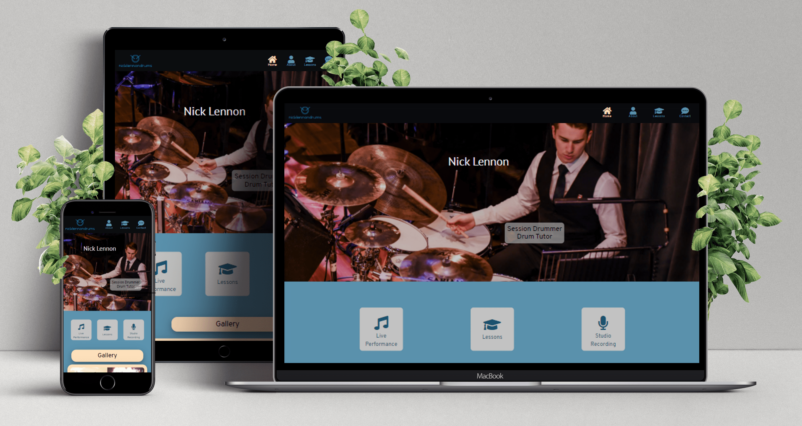
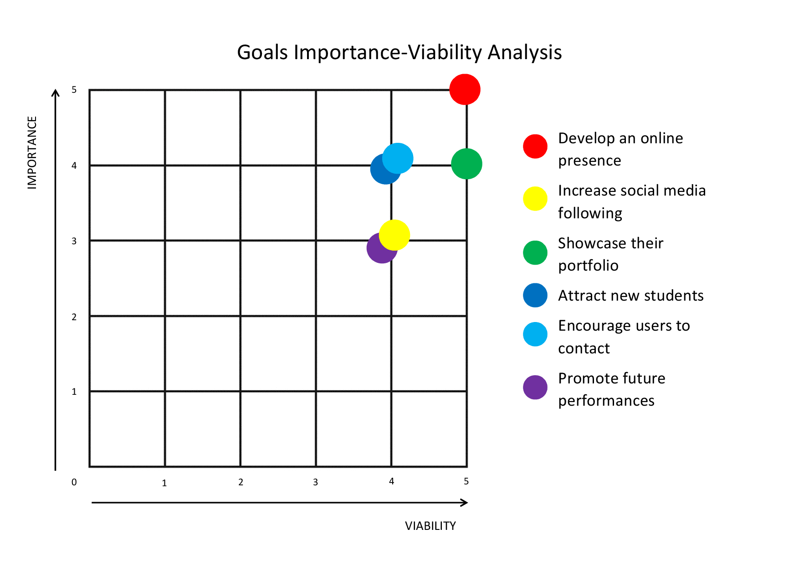
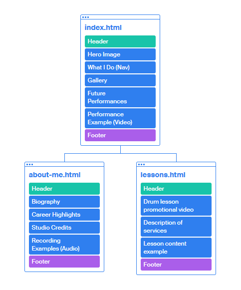
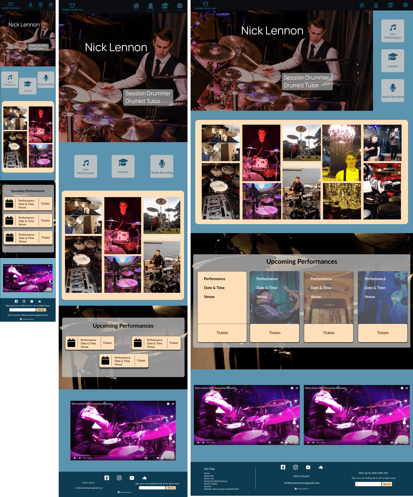
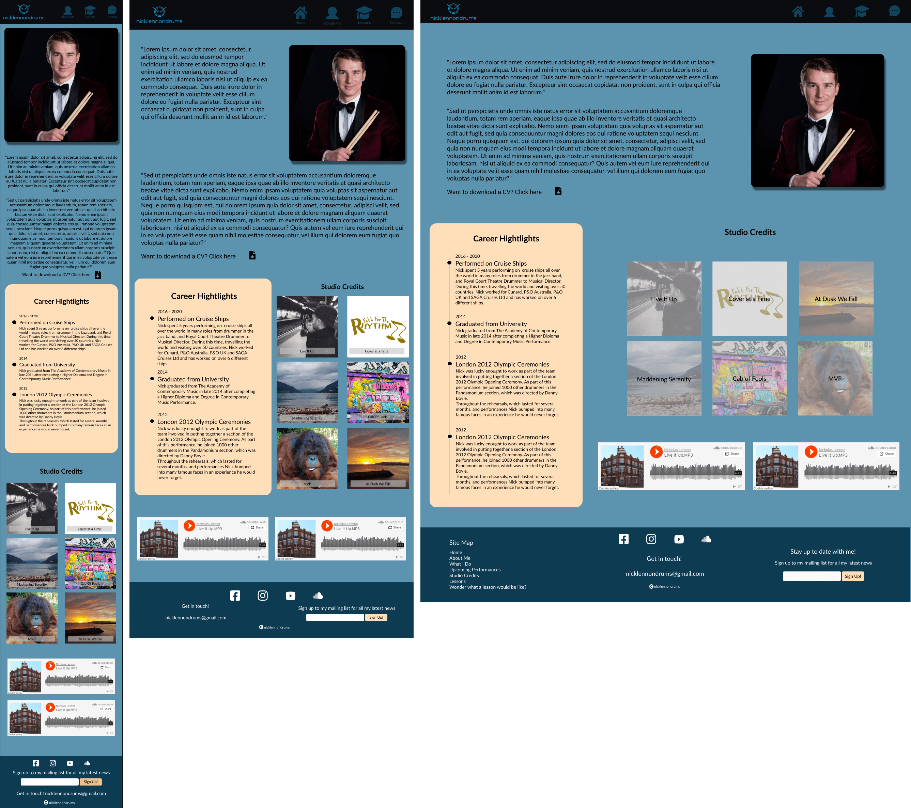
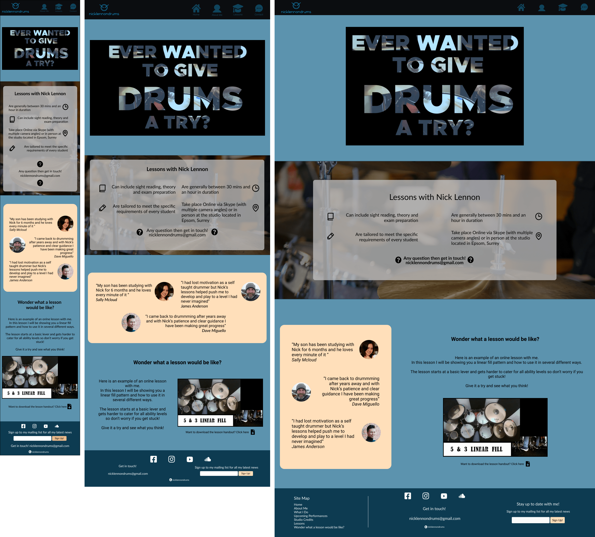

# Nick Lennon - Drummer

[Link to the Live Project](https://"#"/)

# Table of Contents

1. [Introduction](#introduction)
2. [UX](#ux)
3. [Development Planes](#development-planes)
    - [Strategy](#strategy)
    - [Scope](#scope)
    - [Structure](#structure)
    - [Skeleton](#skeleton)
4. [Design](#design)
5. [Features](#features)
6. [Technologies Used](#technologies-used)
7. [Testing](#testing)
8. [Deployment](#deployment)
9. [Bugs and Issues](#bugs-and-issues)
10. [Credits](#credits)

***

#  Introduction

This website has been designer for the **Drummer Nick Lennon** (from here on will be referred to as the “client”) who is a musician who offers services, including **live music performance, recording sessions and tutoring**, to all clients who have an interest in creating, listening to or learning how to play live music. 

This website is based on my own previous work, with some fictitious information added as example content,  before taking up coding as it is an area I am very familiar with and completely understand the needs of the client and the user.

This is the first of four Milestone Projects that make up the Full Stack Web Development Program at The Code Institute. The main requirements of this project are to create a responsive and static website with a minimum of three pages using primarily **HTML5** and **CSS3**.

[Back to top](#nick-lennon---drummer)

# UX
### Project Goals
- To produce a well-designed and engaging website to advertise all services in the most efficient way possible
- To make it easy for users to navigate and access all the information they need.
- To allow users to learn more about the client and their experience.
- To enable users to contact the clientTo showcase the clients abilities	 
- To maintain a clean and professional image at all times
- To enable users to contact the client

## User Demographic
The target demographics for this web site are:
- Potential Students,
- Fellow Musician or Potential Collaborators,
- Fans of Nick Lennon,
- Agents,Recruiters or Potential Employers,

## User Stories

- As a **Potential Student** I want to find information on the client’s lessons, the client’s experience, see previous student testimonials and view examples of the lesson content to help me establish if the client is a good teacher, to encourage me to get in touch if I have any questions and to sign up for lessons
- As a **Musician/Potential Collaborator**, I want to see the client’s previous work/performances, experience and training to allow me to decide if I want to work with them in the future and then to find easy ways to contact them.
- As a **Fan** who saw the client perform, I want to find more information about the client including what their latest music or video is, pictures of client and pervious performances, links to clients current projects, when their next show is, links to buy tickets and to connect with their social networks.
- As an **Agent,Recruiter or Potential Employer**, I want to see information about the client’s training and experience as well as be able to view performances to establish the client’s playing ability and be able to download a copy of the information for future referance, before having an easy way to get in touch.

[Back to top](#nick-lennon---drummer)

# Development Planes
## Strategy
The website will focus on the following user attributes:

**Demographics**
- Ages 18 - 50 years old
- All Genders and Ethnicities
- Employed or Self-Employed

**Psychographics**
- Personalities
    - Outgoing
    - Confident
    - Modest in their abilities
- Lifestyles and attitudes
    - Active interest or passion in Music
    - Looking for new challenges
    - Interested in learning
    - Open to taking advice and constructive criticism

The website needs to enable the **USER** to:
   
    Find information on:
    - Future Performances
    - Client's experience and previous work
    - Services that the client offers
    - How to contact the client
    - Signing up to the clients mailing list

The website needs to enable the **CLIENT** to:
   
    - Develop an online presence
    - Increase social media following
    - Showcase their porfolio
    - Attract new students
    - Encourage users to contact the client about future work
    - Promote future performances

[Back to top](#nick-lennon---drummer)

## Scope
A scope was defined to identify what needed to be included in the project to complete the goals defined in the strategy section.

**Content Requirements**

    - Images of the client and previous performances
    - Future live performance information with links to ticket sales
    - Video performance examples
    - Client biography with basic CV download optiion
    - Studio credits with links to preview and buy the recordings
    - Drum lesson promotion video
    - Description of drum lesson services
    - Drum lesson example video with accompanying PDF download
    - Call to action to get in contact in regards to lessons and project enquires
    - Links to social media accounts
    - Mailing list sign up form

**Functionality Requirements**

    - Easy navigation to the required information
    - Quick loading of the website
    - Links to external websites (including ticket sales, youtube for other videos and soundcloud/spotify to listen to music)
    - Provides contact information
    - Mailing list sign up form

[Back to top](#nick-lennon---drummer)

## Structure

This website is organised using a **Tree** structure hireracy to reduce complexiy and make user navigation easier while allowing for a small amount of user exploring to discover information they didn't initially come to the website for.

Here is a diagram of the page structures.

## Reasoning for the page structuring
**index.html** *(linked to from Logo)*. Decided on element order of:
1.	Hero image with name – to confirm identity of website and create a nice landing page,
2.	What I do – to allow quick and easy navigation to desired information while informing new visitors about the client's services.
3.	Gallery – To provide images of the client and previous performances to encourage them to see the client live.
4.	Future Performances with Video Performance Example – *(linked to from What I Do)* Advertises future performances, with direct links to ticket sales, and shows an example of a live show to encourage new visitors to buy tickets. These elements have been places at the bottom as fans coming looking for new performances to see will also see the social links in the Footer as the screen size from the top of Future Performances includes the footer. Using a link from YouTube will also direct the user to videos of other performances and shows increasing social media engaguement.
	
**about.html**. Decided on element order of:
1.	Image, Bio and Career Highlights (with CV download link) - this is what users that selected the about me page will be looking for primarily with the download link for the Agent,Recruiter or Potential Employer demographic.
2.	Studio credits - *(linked to from What I Do)* acts as evidence for the bio and when users are interested in recording services, they will also want to know about the background of the client. All album covers have links to the album to listen and purchase.

**lessons.html** *(linked to from What I Do and NavBar)*. Decided on element order of:
1.	Lessons Promotional Video – *(auto playing but muted when page loads)* gives general information in a succinct and informative way.
2.	Description of Services – general bullet point overview. Important to get information over as fast as possible if the user doesn’t watch the video or to reinforce the main points again if they do.
3.	Testimonials – potential students are not experienced in what they are looking into so can be persuaded to use the client’s services by current or previous students/parents of students leaving good reviews.
4.	Example Lesson – A video lesson example to show a user what the service would be like (including handout pdf download for the full experience)

In the footer **(linked to from the "Contact" in the Header element)** of every page there is:

    - Links to social media accounts
    - Contact information
    - Mailing list sign up form
    - Site map (desktop only)

[Back to top](#nick-lennon---drummer)

## Skeleton

Wireframes were created in Balsamiq and Figma. Balsamiq was used to design the basic structure and Figma for the design elements. This system was used to focus on the two processes seperatly, enabling each area to be tailored to the users requirements.

Full Original Balsamiq Wireframe:

Index Page (Figma):

About Me Page (Figma):

Lessons Page (Figma):

[Back to top](#nick-lennon---drummer)

# Design

## Colour Scheme
The main colours used throughout the website are a mixture of Black, White, Blue and Peach.

The chosen colour scheme is to give the website a modern feel that will appeal to the wide demographic.

## Typography
Using the fonts fonts [Manrope](https://fonts.google.com/specimen/Manrope "Link to Manrope Google Font") and [Lato](https://fonts.google.com/specimen/Lato "Link to Lato Google Font") is used throughout the website with Sans Serif as the fallback font in case of import failure. 

## Imagery
The images used are all appropriate to the website and are vibrant and engaguing. Video ave been used to reduce the amount of text required in some sections.
All imagery provides alternative text to be used in the event that the element cannot be rendered or if the user is using a screen reader

[Back to top](#nick-lennon---drummer)
# Features

### Header 
- Company logo - establishes the website identity and doubles as the home button for the phone breakpoint
- Navbar links with logo (which have the labels appearing on focus from the Desktop breakpoint upwards)
### Footer
- Footer  doubles as contact information (until contact page is implimented on next release)
- Sign Up For Newsletter (not currently linked to a mailing server will be implemented on next release)
- Site Map (only on Desktop breakpoint)
### index.html
- Hero Image - A strong image to welcome the user to the website while 
- What I Do - quick navigation to the secondary topics of information
- Gallary - Give the user a brief visual insite into the clients experience
- Upcoming Performances - Future performance details with links to ticket sales websites
- Live Performance Video - showcases a previous performance to encourage the user to buy tickets
### about-me.html
- About Me - Profile picture with biography to give indepth information about the clients background in their field
- Career highlights - A vertical timeline to give the user an overview of the important points from the clients experience if they don't want to read the biography
- Studio Credits - Cover art of previous recording work. Each images will link to spotify to allow you to listen to the music. Images have a hover feature to show the name of the song for the Desktop breakpoint. Audio samples are also avaliable underneath the album images using Soundcloud.
- Basic CV Download - A stripped down CV to allow recruiters to retain a copy of it for future reference
### lessons.html
- Lesson Video Advert - A short advert for the clients tutoring service. The video plays but muted to draw the user in but all the important information is displayed on the screen in text.
- Lessons Overview - A revision of the main points from the video with clear icons to enable faster understanding
- Testimonials - Short statements from current pupils to persuade users to sign up for a lesson
- Example lesson - A short video lesson to act as an example of the clients services with a brief introduction and a download link to supporting documentation

## Features Left to Implement
* Why take Up Drumming - A section to inform the user about the many positive aspects to learning how to play the drums
* Endorses Section - A section to inform the user about what products the client uses therefore encouraging the potential student or fellow musician to use the same product which could lead to opening avenues for company collaborations
* Contact page - A new page with several contact options

[Back to top](#nick-lennon---drummer)

# Technologies Used
In this section, you should mention all of the languages, frameworks, libraries, and any other tools that you have used to construct this project. For each, provide its name, a link to its official site and a short sentence of why it was used.

- HTML5
- CSS3
- Bootstrap v4.3.1
- Google Chrome Dev tools for debugging
- Google Light house for audits
- Tiny Png for condensing images
- Fontawesome and Phosphor Icons were used for the icons throughout (https://fontawesome.com/ https://phosphoricons.com/)
- Original wireframes were created with Balsamiq and Figma (https://balsamiq.com/, https://www.figma.com/)

[Back to top](#nick-lennon---drummer)

# Testing

### Testing planning
### Implementation
### Results and outcomes

[Back to top](#nick-lennon---drummer)

# Deployment

[Back to top](#nick-lennon---drummer)

# Bugs and Issues

[Back to top](#nick-lennon---drummer)

# Credits

## Content

All content on this site is original

[Back to top](#nick-lennon---drummer)

## Media
All my images that were used during the development of this site is original content or taken from Pixabay

Drumming related:
- https://pixabay.com/photos/drums-live-dancing-entertainment-755530/
- https://pixabay.com/photos/drums-drum-pool-snare-drum-2778190/
- https://pixabay.com/photos/drummer-drum-set-drums-music-5229705/

Venues:
- https://pixabay.com/photos/concert-park-venue-music-artist-4634009/
- https://pixabay.com/photos/metz-france-opera-theatre-interior-86226/
- https://pixabay.com/photos/performance-music-musician-concert-3202707/
- https://pixabay.com/photos/guitar-rock-music-concert-sound-2006563/

[Back to top](#nick-lennon---drummer)

## Acknowledgements
Readme template used to produce this documentation is from https://github.com/Code-Institute-Solutions/readme-template

[Back to top](#nick-lennon---drummer)
